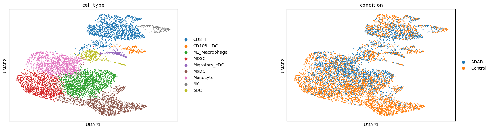
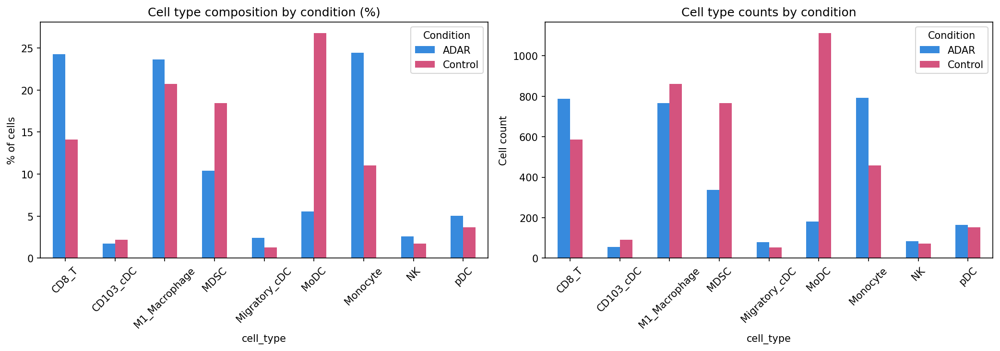
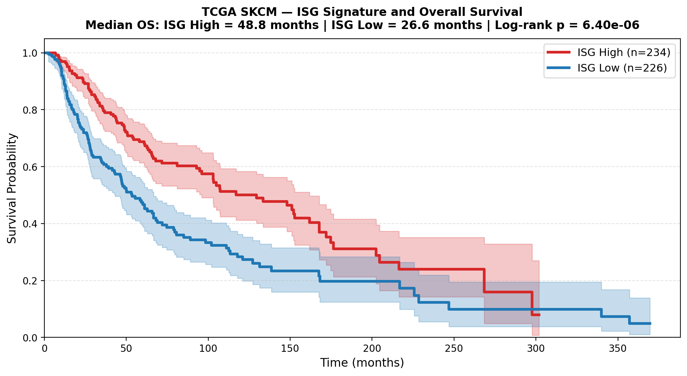

# ADAR1 Loss Reshapes Tumor Immune Microenvironment  
## Single-Cell Analysis with Translational Survival Validation

**Dataset:** GSE110746 — Ishizuka et al. 2019, *Nature*  
**Validation:** TCGA SKCM (n=460 patients)

---

## Biological Question

ADAR1 is an RNA-editing enzyme that suppresses innate immune
sensing by converting endogenous double-stranded RNA (dsRNA)
to inosine. When ADAR1 is lost in tumour cells, unedited dsRNA
accumulates and triggers MDA5-mediated type I interferon (IFN)
production, reshaping the tumour immune microenvironment (TME).

This project asks:

1. Which tumour-infiltrating immune populations activate
   interferon-stimulated gene (ISG) programs under ADAR1 loss
   at single-cell resolution?

2. Does an ADAR1-associated ISG signature derived from
   mouse scRNA-seq correlate with survival in human
   melanoma patients?
---

## Key Findings

> ISG upregulation concentrated in **Monocytes**, **pDCs**, and **CD8 T cells**  
> under ADAR1 knockout — validated against TCGA SKCM patient outcomes

| Finding | Result |
|---|---|
| ISGs upregulated in ADAR KO | Irf7, Isg15, Ifit2, Ifit3, Oasl1, Rsad2 across Monocytes, pDC, CD8 T, MoDC, MDSC |
| CD8 T cell infiltration | 24% ADAR KO vs 14% Control |
| MDSC proportion | 10% ADAR KO vs 18% Control |
| TCGA SKCM survival | ISG-high: 48.8 months vs ISG-low: 26.6 months |
| Log-rank p-value | 6.40 × 10⁻⁶ (n=460 patients) |

---

## Results

### Tumour-Infiltrating Immune Cell Populations


### Immune Composition Shift — ADAR KO vs Control

    
### ISG Signature Predicts Survival — TCGA SKCM


---

## How It Works

```
GSE110746 (mouse scRNA-seq)          TCGA SKCM (human bulk RNA-seq)
4 samples | 7,403 immune cells       460 patients | overall survival
        ↓                                      ↓
Scanpy pipeline                      ISG signature scoring
QC → clustering → annotation    →    Kaplan-Meier survival analysis
Condition DE (ADAR KO vs Control)    Log-rank test
        ↓                                      ↓
ISG upregulation in                  ISG-high patients survive
Monocytes, pDC, CD8 T          →     22.8 months longer (p=1.53×10⁻⁷)
```

---

## Reproduce

```bash
# Install
pip install -r requirements.txt

# Step 1 — pipeline
python scrna_pipeline.py \
  --input data/GSE110746 \
  --input_type 10x_mtx_v2 \
  --outdir outputs/GSE110746

# Optional — generate PanglaoDB marker reference (already included in scrna_annotation.py)
python panglodb_markers.py

# Step 2 — annotation
python scrna_annotation.py

# Step 3 — survival analysis
python tcga_isg_survival.py
```

---

## Limitations

- Condition DE was performed using Wilcoxon tests on individual cells
  (n=2 replicates per condition) rather than replicate-aware pseudobulk methods;
  results should therefore be interpreted as exploratory.
- No doublet detection (Scrublet) or ambient RNA correction (SoupX).
- TCGA survival association reflects IFN-active tumours broadly;
  causal role of ADAR1 loss requires ADAR1 mutation data.

→ [Full limitations](supplementary/limitations.md)  
→ [Cell type annotation detail](supplementary/cell_type_annotation_table.md)  
→ [Pipeline parameters](supplementary/pipeline_parameters.md)

---

## Reproducibility

Results were generated on macOS Apple Silicon (M-series chip).
To reproduce exactly:

```bash
conda env create -f environment.yml
conda activate spatial
```

Random seeds are fixed at 42 throughout the pipeline.
Results may differ on non-Apple-Silicon hardware due to
platform-level numerical precision differences in UMAP
and Leiden clustering — this is a known limitation of
scRNA-seq analysis tools and not specific to this project.
Core biological findings (ISG signature, survival result)
are robust to these differences.

---

## Reference

Ishizuka JJ et al. Loss of ADAR1 in tumours overcomes resistance to immune 
checkpoint blockade. *Nature* 2019;565:43–48. 
doi:[10.1038/s41586-018-0768-9](https://doi.org/10.1038/s41586-018-0768-9)